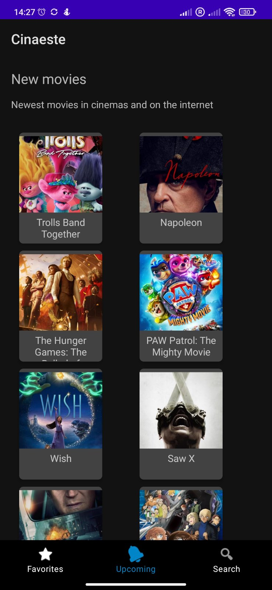
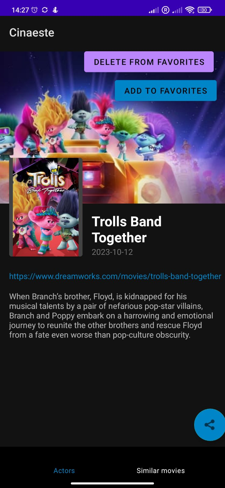
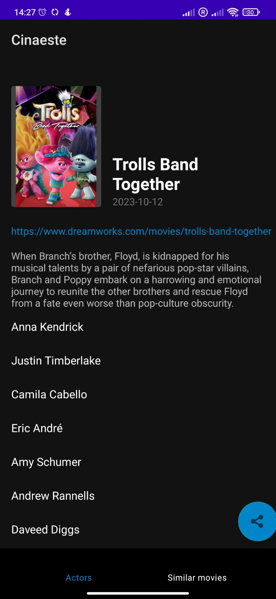
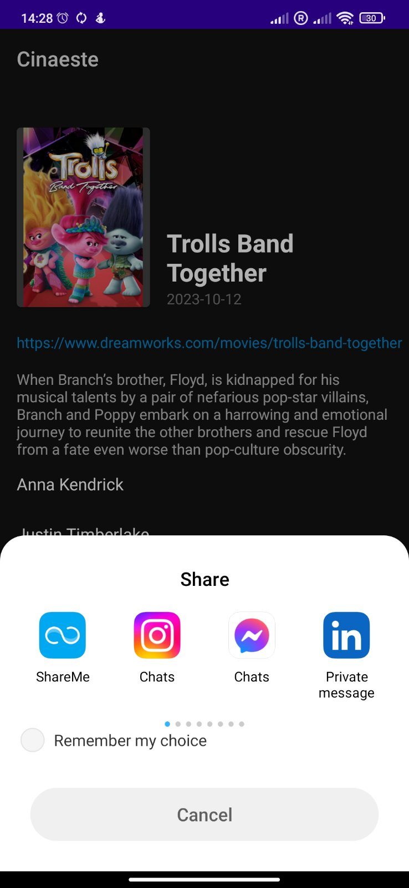
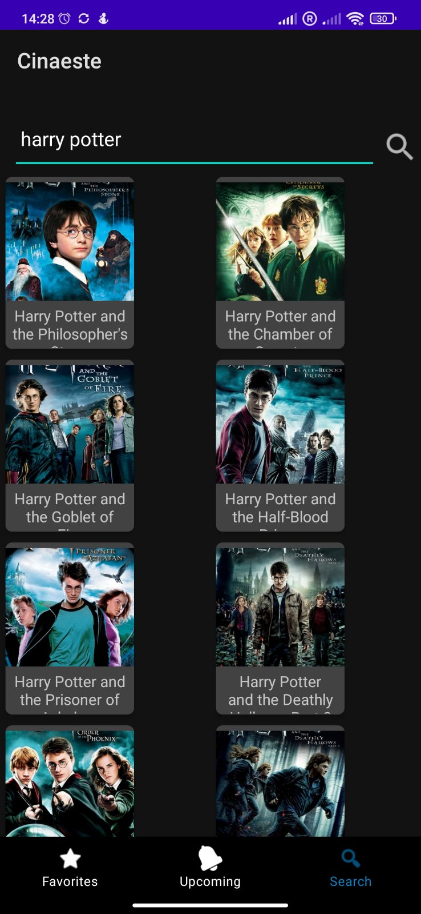
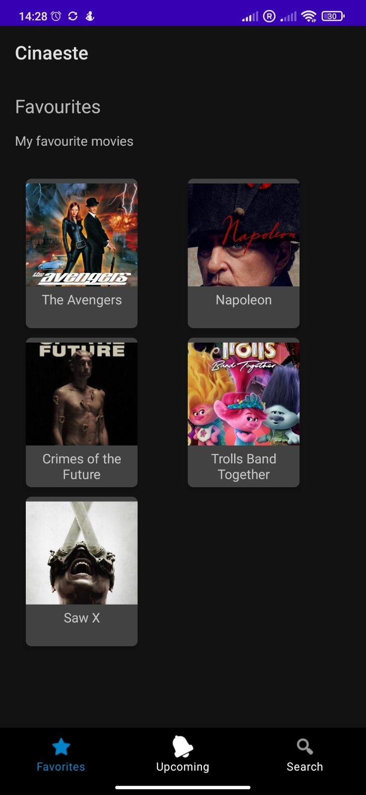

# Movie-App-RMA
Project for course "Mobile application development"

<h2>Movie Explorer App</h2>

The project is an Android Mobile Application, developed in Kotlin.

<h2>Key Features:</h2>
  <ul>
    <li><strong>Browse Upcoming Movies: </strong>Explore the list of upcoming movies with detailed descriptions, including information about the cast and crew.</li>
    <li><strong>Search movies: </strong>Find specific movies based on their name.</li>
    <li><strong>Favourites List: </strong>Add movies to the list of favorite movies. The user can remove movies from the same list at any time.</li>
    <li><strong>Notifications for New Releases: </strong>The user regularly receives notifications about any new and upcoming movies.</li>
    <li><strong>Discover Similar Movies: </strong>For each movie the user can browse through a list of similar movies.</li>
  </ul>

<h2>API Integration:</h2>

This app fetches movie data from <a href="https://www.themoviedb.org/" target="_blank">The Movie Database (TMDb)</a> using their API.

